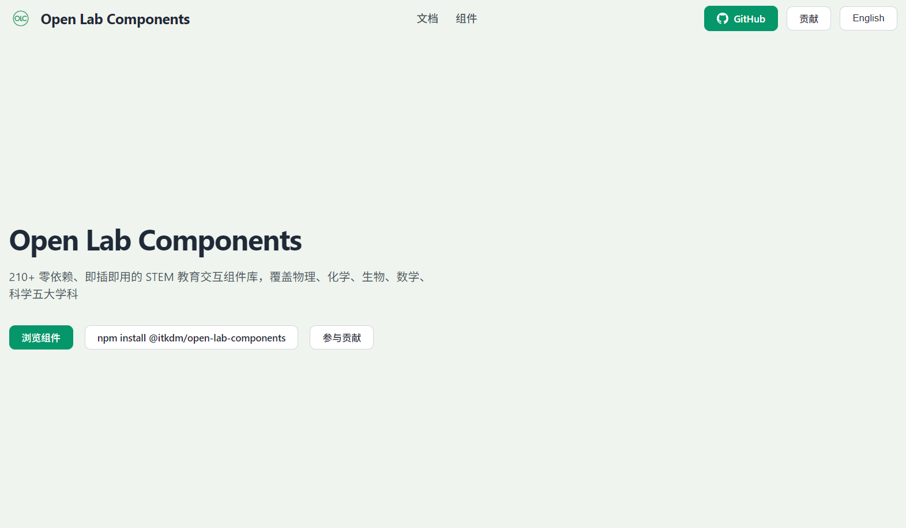

<div align="center">

# 🔬 Open Lab Components

<p>
  <b>English</b> | <a href="./README.md">中文</a>
</p>

<p>
  <a href="https://www.npmjs.com/package/@itkdm/open-lab-components"></a>
  <a href="./LICENSE"></a>
  <a href="https://nodejs.org/"></a>
</p>

<p>
  <strong><a href="http://olc.itkdm.com">🌐 Live Demo: olc.itkdm.com</a></strong>
</p>

<p><strong>A STEM teaching component infrastructure for host apps and AI clients.</strong></p>

<p><em>One catalog delivered consistently as reusable HTML fragments, searchable registry data, JS APIs, a static site, and MCP capabilities.</em></p>

<br/>



</div>

## At a Glance

| Icon | Surface | Description |
| --- | --- | --- |
|  | Component fragments | Zero-dependency HTML fragments ready for host pages. |
|  | Structured catalog | Supports category navigation, search, and filtering logic. |
|  | Programmatic integration | Access and render components via `lab.*` APIs. |
|  | Visual asset gallery | Reusable knowledge maps, flowcharts, and diagrams organized by subject. |
|  | Visual browsing site | Browse and preview components for teams and contributors. |
|  | Agent interface | Exposes tools, prompts, and resources for AI clients. |

## 📚 Table of Contents

- [💡 Why Open Lab Components](#💡-why-open-lab-components)
- [🎯 Use Cases](#🎯-use-cases)
- [🚀 Capability Snapshot](#🚀-capability-snapshot)
- [🔄 Architecture Loop](#🔄-architecture-loop)
- [⚡ Quick Start](#⚡-quick-start)
- [🤖 MCP at a Glance](#🤖-mcp-at-a-glance)
- [📁 Repository Layout](#📁-repository-layout)
- [💻 Common Development Commands](#💻-common-development-commands)
- [🚧 Generated Output Boundaries](#🚧-generated-output-boundaries)
- [🗺️ Documentation Map](#🗺️-documentation-map)
- [💬 Contact and Support](#💬-contact-and-support)
- [❓ FAQ](#❓-faq)
- [📄 License](#📄-license)

## 💡 Why Open Lab Components

This is not a generic UI toolkit. It is a catalog of teaching objects for education workflows.

- Single source of truth: `components/` is canonical.
- Consistent multi-surface output: registry, site, JS API, and MCP are derived from the same catalog.
- AI-ready by design: structured metadata and agent-callable interfaces are first-class.

## 🎯 Use Cases

| Role | Typical Need | Best Entry |
| --- | --- | --- |
| Learning platform team | Assemble experiment pages quickly with reusable assets | `registry/*.json` + `components/**/*.html` |
| Frontend engineer | Embed teaching components and update props at runtime | `index.js` with `lab.mount / lab.updateProps` |
| AI agent / tutor assistant | Recommend components and generate experiment pages | MCP tools + prompts |
| Course designer | Browse categories and curate lesson-friendly bundles | static site + catalog resources |

## 🚀 Capability Snapshot

| Dimension | Current Status |
| --- | --- |
| Component scale | `213+` components (growing) |
| Category count | `41` categories |
| Locales | `zh-CN`, `en` |
| Default locale | `zh-CN` |
| Manifest | backward compatible with `cmp-manifest/v1`, recommended `cmp-manifest/v2` |
| Node requirement | `>=18.0.0` |

### What You Get

- Zero-dependency HTML fragments ready to copy and use.
- Structured registry data for search, filtering, and catalog logic.
- A unified JS API for programmatic integration.
- A reusable visual gallery for teacher-ready diagrams and knowledge visuals.
- Agent-callable MCP tools, prompts, and resources.

## 🔄 Architecture Loop

```text
components/ (source of truth)
  |
  +--> registry/*.json (structured catalog)
  +--> lib + index.js (programmable API)
  +--> visuals/ (teacher-ready visual assets)
  +--> site/ (visual browsing and demo)
  +--> mcp-server/ (agent-callable interface)
```

This keeps host apps, content systems, and AI clients aligned on the same component facts.

### JS API

The root entrypoint is [index.js](./index.js). Public exports include:

- `lab.list(filter, { locale })`
- `lab.get(id, { locale })`
- `lab.categories()`
- `lab.readSync(id)`
- `lab.read(id)`
- `lab.resolve(id)`
- `lab.mount(html, container, props)`
- `lab.unmount(container)`
- `lab.updateProps(container, props)`
- `lab.visuals.list(filter, { locale })`
- `lab.visuals.get(id, { locale })`
- `lab.visuals.subjects()`

## ⚡ Quick Start

Whether you are a non-coder teacher or a professional frontend developer, you can easily get started.

### 👨‍🏫 For Teachers & Content Creators: Try to visual site

No coding is required. Simply visit our **interactive static preview site** (or run `npm run dev:site` locally to spin it up) where you can:
1. **Browse Components**: Intuitively view teaching objects across physics, chemistry, biology, math, etc.
2. **Tweak Parameters**: Modify attributes (like resistance or spring constant) in the configuration panel and see real-time updates.
3. **Copy & Reuse**: Once satisfied, click "Copy Fragment" to copy the customized HTML and inject it straight into your own lesson plans, blogs, or host platforms.

### 🧑‍💻 For Frontend Developers: Integration into Web Projects

If you need to dynamically render and handle these components, follow these steps:

**1) Install dependencies:**
```bash
npm install @itkdm/open-lab-components
```

**2) Prepare an HTML mount point (you can grab this right from the demo site):**
```html
<div
  class="cmp"
  data-cmp-id="phy.resistor.axial.basic"
  style="--cmp-size: 80px; --cmp-body: #caa070;"
>
  <!-- Component DOM will be attached here -->
</div>
```

**3) Mount and control components through JS API:**
```js
import * as lab from '@itkdm/open-lab-components';

// Target your container
const container = document.querySelector('.cmp');
// Load the raw component template
const componentHtml = lab.readSync('phy.resistor.axial.basic');

// Mount to DOM with initial properties
lab.mount(componentHtml, container, { resistance: 100 });

// Dynamically update properties based on user interactions!
lab.updateProps(container, { resistance: 200 });
```

**4) Query components using the Registry:**
```js
// Fetch all components under physics/circuit category with language preference
const circuitCmpList = lab.list({ category: 'physics/circuit' }, { locale: 'en' });
```

### 🛠️ For Open Source Contributors: Local Development

```bash
git clone https://github.com/itkdm/open-lab-components.git
cd open-lab-components
npm install

# Build generated outputs and start the site locally
npm run build
npm run dev:site
```

## 🤖 MCP at a Glance

The MCP implementation is in [mcp-server/](./mcp-server), with both local `stdio` and remote `Streamable HTTP` modes.

| Capability Type | Public Surface |
| --- | --- |
| tools | `get_categories`, `list_components`, `search_components`, `recommend_components`, `submit_recommendation_feedback`, `get_recommendation_feedback_stats`, `build_experiment_page`, `compose_experiment_bundle`, `get_component` |
| prompts | `component-recommendation-brief`, `component-page-builder`, `experiment-page-executor`, `experiment-bundle-integrator` |
| resources | `openlab://catalog/overview`, `openlab://catalog/categories`, `openlab://catalog/featured`, `openlab://component/phy.resistor.axial.basic` |

See also:

- [docs/MCP.en.md](./docs/MCP.en.md)
- [docs/MCP.zh-CN.md](./docs/MCP.zh-CN.md)
- [mcp-server/README.md](./mcp-server/README.md)
- [mcp-server/README.zh-CN.md](./mcp-server/README.zh-CN.md)

## 📁 Repository Layout

```text
components/    component source files and source of truth
registry/      generated registry, category, and tag data
lib/           root JS API, i18n, runtime, and registry loader
site/          static preview site source and dist output
mcp-server/    MCP package and remote runtime
tools/         validation, build, site, and release scripts
docs/          specs, integration, release, and MCP docs
tests/         root API and contract tests
```

## 💻 Common Development Commands

| Goal | Command |
| --- | --- |
| Full validation and build | `npm run validate && npm run build` |
| Build registry data | `npm run build:registry` |
| Build static site | `npm run build:site` |
| Local preview site | `npm run dev:site` |
| Root API tests | `npm run test:root` |
| MCP tests | `npm run mcp:test` |
| Pre-release checks | `npm run release:ready` |

## 🚧 Generated Output Boundaries

- `registry/*.json` is generated by `npm run build:registry`.
- `site/dist/` is generated by `npm run build:site`.
- Avoid manually editing generated outputs as a primary maintenance path.

## 🗺️ Documentation Map

- Specs and integration:
[Component Spec](./docs/SPEC.en.md) · [Category Rules](./docs/CATEGORY.en.md) · [Event Protocol](./docs/EVENT.en.md) · [Integration Guide](./docs/INTEGRATION.en.md)
- Collaboration and release:
[Contribution Guide](./docs/CONTRIBUTING.en.md) · [Deployment Guide](./docs/DEPLOYMENT.en.md) · [Release Checklist](./docs/RELEASE-CHECKLIST-0.2.0.en.md)
- MCP:
[MCP English Docs](./docs/MCP.en.md) · [MCP 中文文档](./docs/MCP.zh-CN.md)

## 💬 Contact and Support

If this project helps you, feel free to contact or support via the QR codes below.


<table>
  <tr>
    <td align="center" width="50%">
      <strong>Alipay QR</strong><br />
      
    </td>
    <td align="center" width="50%">
      <strong>WeChat Contact / Support QR</strong><br />
      
    </td>
  </tr>
</table>

## ❓ FAQ

### Q1: Should I edit registry JSON files directly?

Usually no. `registry/*.json` files are generated outputs; update `components/` and run the build pipeline instead.

### Q2: Why do MCP and JS API see the same catalog?

Both are derived from the same source-of-truth component set and generation workflow.

### Q3: Is this production-ready?

Yes, with recommended guardrails: lock versions, run `npm run validate`, and keep regression tests in CI.

## 📄 License

[MIT](./LICENSE)
